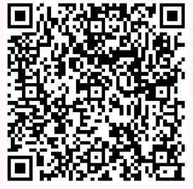

## 刷单教程

1. [返利网站注册](http://mmm.xfz178.com/wap/login/register?re_uid=3042869)
2. 下载并安装【淘宝】
    * 淘宝-安卓
    * 
    * 淘宝-苹果
    * 
3. 下载并安装【消费者联盟】
    * 消费者联盟-安卓
    * 
    * 消费者联盟-苹果
    * 
4. 打开【消费者联盟】软件，搜索关键字： Chinanet3小时电信wifi天翼无线上网账号1/3/6/7一天校园h时长卡，找到商品进入下一步。
5. 找到商品【Chinanet3小时电信wifi天翼无线上网账号1/3/6/7一天校园h时长卡】，点击购买，跳转到【淘宝】，支付成功复制订单号。
6. 回到【消费者联盟】打开：我的->找回订单->认领订单，然后淘宝确认收货，返利到账联盟账户，第一次需要绑定支付宝手动提现，以后是每个月21号自动打到支付宝！

## 问题集锦
1. 支付宝如何绑定？
> 打开消费者联盟APP，进入“我的”界面 → 选择点击“登记支付宝”。

2. 如何查看提现是否到账？
> 打开消费者联盟APP，“首页”→点击“通知”→查看消息。

3. 提现的周期有多长？
> 伙伴会员每个月2号自动提现上个月的奖励，在当月的21-30号之间陆续到账。

4. 如何提现可用余额？
> 方式一：通过消费者联盟APP会员界面，点击“立即提现”进入，即可提现。
> 方式二：通过Q宝机器人发送指令：“提现”，即可发起新会员首次提现。
> 方式三：新会员首次提现2元成功后，便成为消费者联盟的伙伴会员，伙伴会员提现是在每个月的2号发起自动提现上个月的奖励。

